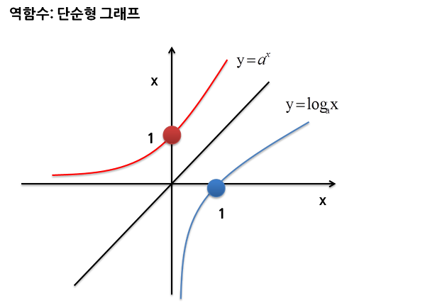
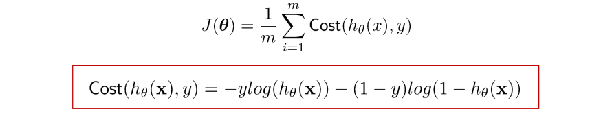

### 크로스 엔트로피(Cross Entropy)

---

=> 분류(Classification)에서 주로 사용되는 cost function

Logistic Regression의 costFunction을 알아보면서 크로스엔트로피 식을 유도

**Logistic Regression**

선형회귀모델은 이항 분류에 적절하지 않음 (pass(1)/fail(0))

X값이 큰 데이터가 들어왔을 경우 잘못된 학습을 할 수 있음

**시그모이드(Sigmoid) 함수**

 

x=0 을 중심으로, 좌측은 0으로 수렴 우측은 1로 수렴

Logsitic Regression은 이 시그모이드 함수를 사용하여 **가설(hypothesis)**을 정의

y = sigmoid(wx + b)

Sigmoid 함수를 사용하면 positive( z>= 0) 과 negative (z<0)의 구분이 매우 확연해짐

**비용함수(cost function)**

LinearRegression의 코스트함수는 MSE를 사용하여 구함,

LogsticRegression는 MSE를 사용하면 non-convex 하기 때문에 비용의 최저를 알아내기가 힘들기 때문에 새로운 코스트함수를 사용

**g(z)에 따른 비용**

**지수함수와 로그함수의 관계**

**결과**

=> 크로스 엔트로피 공식

g(z)는 모델일 뿐, g(z)를 최소화 시켜주는 모델

### SVM의 비용함수(cost function)

---

**z와 cost에 관계**

모양이 경첩같다 하여 hinge function이라고도 부름

최적화 및 계산상의 이득을 취할 수 있다는 장점이 존재

연두색으로 표시한 것이 SVM 의 cost function

### SVM 모델의 최적화

---

**규제**

* cost 최적화에 영향이 없는 상수 m 제거
* 새로운 매개변수 C를 이용하여 함수를 최적화하는 방식 사용
* 치환이 되었기 때문에 전체를 고려하여 minimize를 시켜줌

